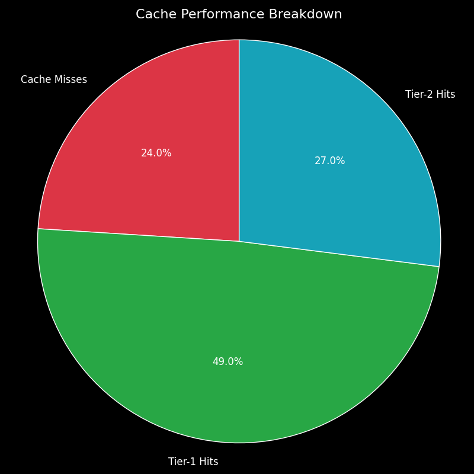

# LLM Inference Cache with Semantic Similarity

This project is a comprehensive, full-stack implementation of a tiered semantic caching system for Large Language Model (LLM) inference. It is designed to solve the critical challenges of high latency and computational cost associated with deploying LLMs in production environments.

The system intelligently caches LLM responses and serves them for subsequent queries that are not just textually identical, but **semantically equivalent**. This is achieved through a state-of-the-art tiered architecture combining a high-speed exact-match cache with a powerful semantic vector search cache.


_Recommendation: Create a short screen recording (GIF) of your chatbot and dashboard working side-by-side, upload it to a service like Imgur, and paste the direct link here._

---

## Table of Contents
- [Problem Statement](#problem-statement)
- [Our Solution: A Tiered Caching Architecture](#our-solution-a-tiered-caching-architecture)
- [Live Demo Components](#live-demo-components)
- [Performance Metrics](#performance-metrics)
- [Technology Stack](#technology-stack)
- [Project Structure](#project-structure)
- [Setup and Installation](#setup-and-installation)
- [How to Run the Project](#how-to-run-the-project)
- [Future Work](#future-work)

---

## Problem Statement

Large Language Models are computationally expensive and slow. In real-world applications, users frequently ask the same question using different wording. Traditional caching methods, which rely on exact text matches, fail to handle this linguistic variation. This leads to redundant, expensive API calls to the LLM, increasing both user latency and operational costs.

**Example of Traditional Cache Failure:**
- **User A asks:** `"What is the capital of France?"` -> `CACHE MISS` (calls LLM)
- **User B asks:** `"france's capital?"` -> `CACHE MISS` (calls LLM again for the same answer)

---

## Our Solution: A Tiered Caching Architecture

This project implements a sophisticated, multi-layered caching system that understands the *meaning* of a prompt, not just the words.

- **Tier 1: Redis Cache (Exact-Match):** A lightning-fast in-memory cache that handles high-frequency, identical queries with microsecond latency.
- **Tier 2: ChromaDB Cache (Semantic Match):** A powerful vector database that stores prompt embeddings. If a new prompt is semantically similar to a cached one, it serves the response, avoiding the LLM call. This is powered by the `BAAI/bge-large-en-v1.5` embedding model.
- **Tier 3: Google Gemini LLM (Cache Miss):** Only if both caches miss does the system make an expensive call to the primary LLM. The response is then used to populate both cache tiers.

This system also includes an **LRU (Least Recently Used) eviction policy** to manage the cache size and a **quality admission policy** to prevent caching low-quality responses.

---

## Performance Metrics

A load test simulating 100 user prompts demonstrated the system's effectiveness, achieving a **76% total cache hit rate**.

| Response Type          | Average Latency | Speed Improvement (vs. LLM) |
| ---------------------- | --------------- | --------------------------- |
| LLM Call (Cache Miss)  | ~4541 ms        | 1x                          |
| **T2 Semantic Hit**    | **~204 ms**     | **~22x faster**             |
| **T1 Exact-Match Hit** | **~5 ms**       | **~900x faster**            |

![Latency Comparison Chart]



---

## Technology Stack

- **Backend:** FastAPI, Uvicorn
- **LLM:** Google Gemini API (`gemini-pro`)
- **Semantic Caching (Tier 2):**
  - **Vector Database:** ChromaDB
  - **Embedding Model:** `BAAI/bge-large-en-v1.5`
- **Exact-Match Caching (Tier 1):** Redis
- **Frontend & Dashboard:** Streamlit
- **Containerization:** Docker (for Redis)
- **Core Libraries:** `sentence-transformers`, `requests`, `python-dotenv`

---

## Project Structure
```llm-semantic-cache/
├── api/
│   ├── main.py             # FastAPI server and tiered caching logic
│   └── services/
│       ├── cache_manager.py  # ChromaDB logic (LRU, Admission)
│       ├── llm_provider.py   # Gemini and Embedding Model logic
│       └── metrics_manager.py # In-memory metrics tracking
├── chatbot/
│   └── chatbot_ui.py       # Streamlit Chatbot App
├── dashboard/
│   └── dashboard_ui.py     # Streamlit Dashboard App
├── .env                    # Environment variables (API keys, etc.)
├── requirements.txt        # Python dependencies
├── load_tester.py          # Script for performance testing
└── README.md
