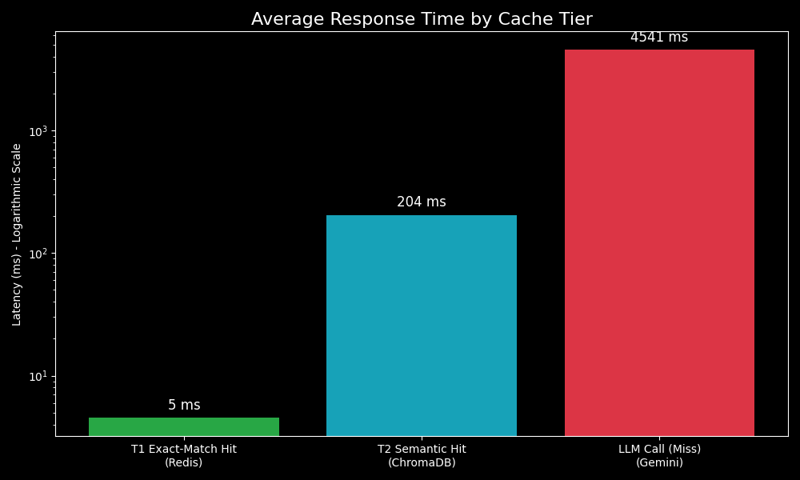

# LLM-semantic-cache

This project is a comprehensive, full-stack implementation of a tiered semantic caching system for Large Language Model (LLM) inference. It is designed to solve the critical challenges of high latency and computational cost associated with deploying LLMs in production environments.
The system intelligently caches LLM responses and serves them for subsequent queries that are not just textually identical, but semantically equivalent. This is achieved through a state-of-the-art tiered architecture combining a high-speed exact-match cache with a powerful semantic vector search cache.


(Recommendation: Create a short screen recording of your chatbot and dashboard working side-by-side and convert it to a GIF. Upload it to a service like Giphy or Imgur and paste the link here.)
Table of Contents
Problem Statement
Our Solution: A Tiered Caching Architecture
Live Demo Components
Performance Metrics
Technology Stack
Project Structure
Setup and Installation
How to Run the Project
Future Work
Problem Statement
Large Language Models are computationally expensive and slow. In real-world applications, users frequently ask the same question using different wording. Traditional caching methods, which rely on exact text matches, fail to handle this linguistic variation. This leads to redundant, expensive API calls to the LLM, increasing both user latency and operational costs.
Example of Cache Failure:
User A asks: "What is the capital of France?" -> CACHE MISS (calls LLM)
User B asks: "france's capital?" -> CACHE MISS (calls LLM again for the same answer)
Our Solution: A Tiered Caching Architecture
This project implements a sophisticated, multi-layered caching system that understands the meaning of a prompt, not just the words.
Tier 1: Redis Cache (Exact-Match): A lightning-fast in-memory cache that handles high-frequency, identical queries with microsecond latency.
Tier 2: ChromaDB Cache (Semantic Match): A powerful vector database that stores prompt embeddings. If a new prompt is semantically similar to a cached one, it serves the response, avoiding the LLM call. This is powered by the BAAI/bge-large-en-v1.5 embedding model.
Tier 3: Google Gemini LLM (Cache Miss): Only if both caches miss does the system make an expensive call to the primary LLM. The response is then used to populate both cache tiers.
This system also includes an LRU (Least Recently Used) eviction policy to manage the cache size and a quality admission policy to prevent caching low-quality responses.
Live Demo Components
The project includes two interactive frontends built with Streamlit:
Chatbot UI: A user-facing chat interface to interact with the caching system.
Performance Dashboard: A live, auto-refreshing dashboard that provides real-time observability into key performance metrics like cache hit rate, latency, and request breakdown.
Chatbot UI	Performance Dashboard


(Recommendation: Take screenshots of your running apps and place them in your project folder, then update these paths.)	
Performance Metrics
A load test simulating 100 user prompts demonstrated the system's effectiveness, achieving a 76% total cache hit rate.
Response Type	Average Latency	Speed Improvement (vs. LLM)
LLM Call (Cache Miss)	~4541 ms	1x
T2 Semantic Hit	~204 ms	~22x faster
T1 Exact-Match Hit	~5 ms	~900x faster


Technology Stack
Backend: FastAPI, Uvicorn
LLM: Google Gemini API (gemini-pro)
Semantic Caching (Tier 2):
Vector Database: ChromaDB
Embedding Model: BAAI/bge-large-en-v1.5
Exact-Match Caching (Tier 1): Redis
Frontend & Dashboard: Streamlit
Containerization: Docker (for Redis)
Core Libraries: sentence-transformers, requests, python-dotenv
Project Structure
code
Code
llm-semantic-cache/
├── api/
│   ├── main.py             # FastAPI server and tiered caching logic
│   └── services/
│       ├── cache_manager.py  # ChromaDB logic (LRU, Admission)
│       ├── llm_provider.py   # Gemini and Embedding Model logic
│       └── metrics_manager.py # In-memory metrics tracking
├── chatbot/
│   └── chatbot_ui.py       # Streamlit Chatbot App
├── dashboard/
│   └── dashboard_ui.py     # Streamlit Dashboard App
├── .env                    # Environment variables (API keys, etc.)
├── requirements.txt        # Python dependencies
├── load_tester.py          # Script for performance testing
└── README.md
Setup and Installation
Prerequisites:
Python 3.11+
Docker Desktop (must be running)
1. Clone the Repository:
code
Bash
git clone https://github.com/your-username/llm-semantic-cache.git
cd llm-semantic-cache
2. Create and Activate Virtual Environment:
code
Bash
python -m venv venv
# On Windows
venv\Scripts\activate
# On macOS/Linux
source venv/bin/activate
3. Install Dependencies:
code
Bash
pip install -r requirements.txt
4. Set Up Environment Variables:
Create a file named .env in the project root.
Add your Google AI API key:
code
Code
GOOGLE_API_KEY="your_google_api_key_here"
REDIS_HOST=localhost
REDIS_PORT=6379
How to Run the Project
You will need to run three services simultaneously in separate terminals.
1. Start the Redis Cache (Requires Docker):
Open a separate terminal and run:```bash
docker run -d --name redis-cache -p 6379:6379 redis
code
Code
*(Note: If the container already exists, start it with `docker start redis-cache`)*

**2. Start the Backend API Server:**
In your first project terminal (with `venv` active):
```bash
uvicorn api.main:app --reload
3. Start the Chatbot UI:
In a second project terminal (with venv active):
code
Bash
streamlit run chatbot/chatbot_ui.py
4. Start the Performance Dashboard:
In a third project terminal (with venv active):
code
Bash
streamlit run dashboard/dashboard_ui.py
Access the chatbot at http://localhost:8501.
Access the dashboard at http://localhost:8502.
